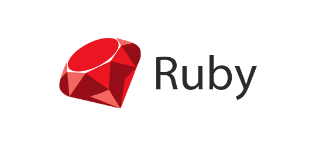

# ✨ MalrangCow ✨  
### A Developer You'd Want to Collaborate With

---
Alooo !! 👋 I’m MalrangCow, a dedicated back-end developer with a zest for creativity and innovation. 😄

When I'm not deep in code, you'll find me riffing on my electric guitar 🎸, immersing myself in gaming 🎮,  
or taking leisurely drives accompanied by my favorite tunes. 🎧 
If any of these resonate with you, we're already friends ! 👬

At [SSAFY] , I've triumphantly wrapped up my first semester and am currently navigating through the second. 🏃

Each day in my software development voyage is energized by an unbridled enthusiasm for learning 🔥💪  
and a steadfast dedication to honing my craft with the latest technologies. 💻

And I'm also the architect 🔨 behind a burgeoning [Blog](https://malrangcow00.github.io) !   
My digital sanctuary is ~~a work-in-progress 🚧,~~ (Now it's done !)  
a budding space where I'll be uploading learning joy and snippets from my daily life.  
(Unfortunately, it supports only Korean for now. 😿)  

Stay tuned for updates, and let’s stack the digital bricks and communicate together ! 🚀

[//]: # (I currently work at ~ as a ~. After ~ years in the “Software Engineering Development Program” - rotating from team to team to learn new technologies and meet other developers - I landed on the Authoring team, which develops our next-generation email campaign editor. I also run the “~” a group focused on improving and modernizing frontend technology for all our engineers.)

[//]: # (In 2014 I graduated from ~ with a B.S. in ~ Development. I studied ~, ~ ;mostly ~;, ~, ~, ~, and more. I also received a Minor in Music & Technology, a combination of music theory, history, culture, and audio engineering.)

[//]: # (Throughout university I was an active member of Computer Science House, a “Special Interest House” with a focus on, you guessed it, computers. I learned a ton while I was there, both through personal projects and just being in an atmosphere of learning and &#40;more importantly&#41; doing.)

[//]: # (Github Stats)
[//]: # ([![malrangcow00's GitHub stats]&#40;https://github-readme-stats.vercel.app/api?username=malrangcow00&#41;]&#40;https://github.com/anuraghazra/github-readme-stats&#41;)

## Computational Thinking

---

[//]: # (Most used Langs)
[//]: # (![Top Langs]&#40;https://github-readme-stats.vercel.app/api/top-langs/?username=malrangcow00&layout=compact&theme=dark&#41;)

## Programming Languages

---
   

[//]: # ()
Now learning: `TypeScript`

## Frameworks & Libraries

--- 
  

   

    

[//]: # (![Static Badge]&#40;https://img.shields.io/badge/React-ffffff.svg?&style=flat&logo=react&logoColor=61dafb&#41;  )

Now learning: `React`, `Python Libraries`  

## Infrastructure & DevOps

---

  

 `Google Cloud Platform`  

  

 
 
 
  

## Tools

---

  

  
 
 
  

  

 
   

## Web Technologies

---

  

## Project

---
### [`tRANvel`](https://github.com/malrangcow00/tRANvel)  
색다른 여행을 즐기고픈 이들을 위한 랜덤 행선지 추천 모바일 앱 서비스  
### [`ShowFin`](https://github.com/malrangcow00/ShowFin)  
금융을 "모르는" 젊은이를 위한 예적금 비교 및 대출 추천 서비스  

## EDUCATION

---
🌆 [SSAFY] : Samsung Software Academy for Youth
> Jul. 2023 ~

[//]: # (### Experience)

[//]: # ()
[//]: # (---)

[//]: # (### Certifications)

[//]: # ()
[//]: # (---)

## Natural Languages

---

한 Korean  
En English  
あ Japanese

## Find me

---
[//]: # (Github에서는 보안상의 이유로 HTML 내 "target="_blank"를 포함하는 등의 일부 속성을 무시한다.)
   

## Contact

---
   

[//]: # (리액트 추가)
[//]: # (Infra 기술 스택 추가)

[//]: # (- 🔭 I’m currently working on ...)
[//]: # (- 🌱 I’m currently learning ...)
[//]: # (- 💬 Ask me about ...)

[//]: # (labelColor 로고 쪽 배경)
[//]: # (logoColor 로고색)
[//]: # (뱃지명 뒤 - 전체 배경 / dash 사용 시 - 오른쪽 배경)
[//]: # (color 오른쪽 배경)

[SSAFY]: https://ssafy.com
